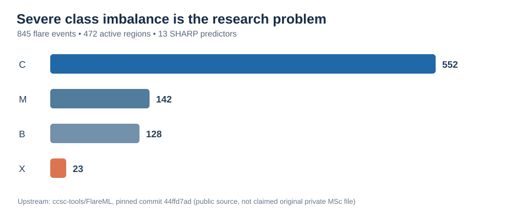
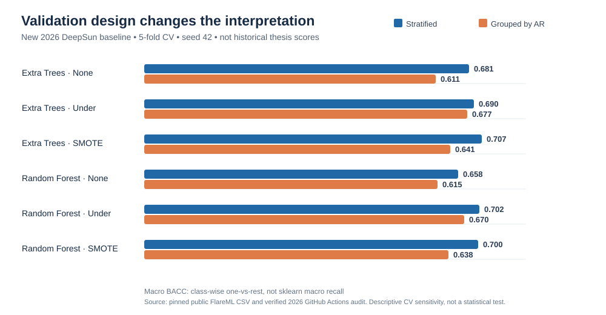

# Machine Learning for Solar Flare Prediction under Severe Class Imbalance

[](https://github.com/fazzyy10/solar-flare-ml-class-imbalance/actions/workflows/deepsun-reconstruction.yml)

**MSc Data Science research record, methodological audit, and post-MSc reproducibility pathway**

This repository documents Mohamed Fawaz Hussain Fareed's 2024 MSc Data Science dissertation at Cardiff Metropolitan University:

> **Application of Machine Learning Modeling in NOAA SHARP Data for Solar Flare Prediction**

The repository has two purposes:

1. preserve the submitted MSc research as a frozen historical record; and
2. develop a transparent reproducibility and methodological-audit pathway without rewriting the assessed work or overstating authorship.

## Start here: research review

This is a **research record**, not a claim to replace the DeepSun forecasting service. The clearest demonstration of the work is the question it asks about rare-event validation and repeated active regions.

**[Read the five-minute research guide](docs/RESEARCH_REVIEWER_GUIDE.md)** · [Methods and measured results](corrected_classical_ml/reconstruction_2026/RESULTS_AND_LIMITATIONS_2026-10-08.md) · [Permanent result tables](results/2026-10-08/) · [Source comparison with DeepSun](docs/UPSTREAM_COMPARISON.md) · [Reconstruction code and notebook](corrected_classical_ml/reconstruction_2026/)





The 2026 grouped-versus-stratified results are verified *new* findings, not the submitted 2024 performance and not a measurement of an operational prediction system. The historical dissertation is preserved unchanged.

## Research problem

The dissertation studied four-class solar-flare prediction (B, C, M, X) using SHARP-derived magnetic parameters. Severe class imbalance was central to the evaluation problem, particularly because X-class events were rare.

The submitted dissertation describes a DeepSun/FlareML-derived dataset covering May 2010 to December 2016 with:

- **845 flare events**
- **472 active regions**
- **128 B-class flares**
- **552 C-class flares**
- **142 M-class flares**
- **23 X-class flares**
- **13 SHARP parameters**
- the dissertation describes normalised values; the verified public original CSV contains raw-scale measurements
- a 24-hour prediction setting

## Submitted MSc evaluation

The submitted study evaluated **14 machine-learning classifiers**:

1. Decision Tree Classifier
2. Extra Tree Classifier
3. Gaussian NB
4. K Neighbors Classifier
5. Linear SVC
6. Passive Aggressive Classifier
7. Ridge Classifier
8. SGD Classifier
9. SVC
10. Bagging Classifier
11. Extra Trees Classifier
12. Gradient Boosting Classifier
13. Linear Discriminant Analysis
14. Random Forest Classifier

The dissertation reports evaluation on the original data plus **100 random-under-sampled** and **100 SMOTE-over-sampled** dataset variants with stratified 10-fold cross-validation. It reports **29,400 model tests** in total and uses **Balanced Accuracy (BACC)** and **True Skill Statistic (TSS)** as the principal metrics.

The submitted thesis reports Extra Trees Classifier as the strongest overall performer, with average BACC **0.829979** and average TSS **0.659958** across the study's reported aggregation.

**Important:** these are historical results reported in the submitted dissertation. This repository does not claim that those numerical results have already been independently reproduced.

## Read the dissertation

The public full-text mirror is here:

**[Submitted MSc dissertation - full text](submitted_msc_record/THESIS_FULL_TEXT.md)**

The original submitted PDF remains the authoritative visual record. Its SHA-256 and provenance are recorded in [submitted_msc_record/SOURCE_PDF_CHECKSUM.md](submitted_msc_record/SOURCE_PDF_CHECKSUM.md). The public text mirror is provided to make the complete dissertation wording directly accessible through GitHub without changing the historical record.

## Integrity and provenance

The public **FlareML** project by **Yasser Abduallah, Jason T. L. Wang, and Haimin Wang** is an upstream research/software source used in the dissertation's research context. It is MIT licensed upstream:

- https://github.com/ccsc-tools/FlareML
- https://doi.org/10.5281/zenodo.5634114

Fawaz is **not** presented as the author of FlareML.

A preserved file in the MSc archive named `ccsc_FlareML.ipynb` was later inspected and found to be an HTML snapshot of the public GitHub page rather than executable notebook JSON. The preserved raw archive therefore does not contain enough executable source and data to support a claim of byte-for-byte reproduction of the original MSc experiments.

For that reason, this repository distinguishes three evidence layers:

- **Submitted MSc record (2024):** frozen historical evidence.
- **Reproducibility / methodology audit:** later inspection of assumptions, validation design, provenance and recoverability.
- **Post-MSc continuation:** any later experiments are explicitly separate from the submitted MSc dissertation.

See [PROVENANCE.md](PROVENANCE.md) and [LICENSES_AND_ATTRIBUTION.md](LICENSES_AND_ATTRIBUTION.md).

## Repository map

```text
.
├── README.md
├── PROVENANCE.md
├── LICENSES_AND_ATTRIBUTION.md
├── CITATION.cff
├── submitted_msc_record/
│   ├── README.md
│   ├── THESIS_FULL_TEXT.md
│   └── SOURCE_PDF_CHECKSUM.md
├── docs/
│   ├── RESEARCH_QUESTIONS.md
│   ├── METHODS_SUBMITTED.md
│   └── RESULTS_SUBMITTED.md
├── data/
│   └── README.md
├── reproducibility_audit/
│   ├── README.md
│   └── VALIDATION_AUDIT.md
├── corrected_classical_ml/
│   └── README.md
├── post_msc_pytorch/
│   └── README.md
└── environment/
    └── README.md
```

## New 2026 executable reconstruction (review branch)

An independently implemented, **post-MSc** baseline module now lives in
[corrected_classical_ml/reconstruction_2026/](corrected_classical_ml/reconstruction_2026/README.md).
It downloads a pinned, publicly available upstream FlareML reference dataset
after verifying Git integrity, then supports Extra Trees / Random Forest
evaluation with optional train-fold-only undersampling or SMOTE. Ordinary
stratified, active-region-grouped, and chronological holdout evaluations are
provided. Tests use **synthetic fixtures**, not a claimed reproduction of
the dissertation's numerical results. Original upstream data are not
redistributed in this repository.

See [the real-data benchmark and limitations](corrected_classical_ml/reconstruction_2026/RESULTS_AND_LIMITATIONS_2026-10-08.md), based on successful GitHub Actions execution of 18 initial configurations, 24 additional repeated-seed configurations and six four-class chronological sensitivity configurations. This is not the recovered 2024 notebook or an independent replication of the thesis's reported 29,400 model tests.

## What is deliberately not claimed

This repository does **not** claim:

- that the exact original MSc code has been recovered;
- that the exact original local dataset has been recovered from the private archive;
- that the historical results are already reproduced;
- that later PyTorch work formed part of the submitted MSc dissertation;
- that the MSc work was a peer-reviewed publication;
- that FlareML was authored by Fawaz.

Those boundaries are intentional.

## Current status

**Historical research record: available.**  
**Public full text: available.**  
**Provenance audit: documented.**  
**Exact reproduction: not currently claimed.**  
**New post-MSc fold-safe benchmark: run and verified on the public DeepSun dataset; historical replication still not claimed.**

The point of this repository is not to make the historical work look cleaner than it was. It is to make the research trail inspectable: what was submitted, what depended on prior public work, what can be recovered, what methodological questions emerged later, and what should be tested next.
